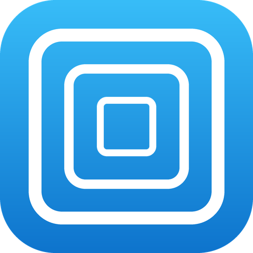

<div align="center">
  
  <h1>Zoomer</h1>
  <p><em>Pinch-to-zoom overlay for Android — magnify and pan any app.</em></p>
</div>

A pinch-to-zoom overlay for Android. Magnify and pan **any** app's content —
blow up a 4:3 video to fill a tall or foldable display, zoom into a UI that has
no zoom of its own — using a floating overlay driven by screen capture.

Think of it as YouTube's pinch-zoom, but available over any single app.

## Features

- **Pinch to zoom, drag to pan** over a live capture of your screen.
- **Two render backends, switchable in-app:**
  - **GPU** (OpenGL ES) — hardware accelerated, smooth, low power. Recommended.
  - **CPU** (Canvas) — software fallback, maximally compatible.
- **Two modes**, toggled from the notification:
  - **Zoom** — the magnified view, with gestures.
  - **Pass** — transparent passthrough so you can tap the real app (pause,
    scrub, etc.); your zoom is preserved when you switch back.
- **One-tap start from Quick Settings** — tap the tile from anywhere, the app
  picker appears over what you're doing, pick the app, and you're zooming.
  Tap the tile again to stop.
- **Switch app mid-session** from the notification, without stopping.
- Screen stays awake while the overlay is active.

## Known limitations

- **Some video apps need CPU mode.** Some apps render video in a hardware
  surface that the GPU capture path doesn't pick up — the video shows black or
  won't zoom. Switching to CPU rendering captures these correctly.
- **Single-app only — whole-screen is deliberately not offered.** Android gives
  an app no way to exclude its own overlay from a whole-screen capture: the
  overlay captures itself in an endless feedback loop, the one exclusion flag
  (FLAG_SECURE) blacks the capture out instead, and driving the system
  magnifier draws a mandatory border around the screen. All three roads were
  tested on-device; single-app capture is the one Android actually supports,
  so it is the one Zoomer ships.
- **The capture dialog appears every session.** That consent is an Android
  privacy requirement and cannot be skipped — Zoomer just removes every other
  step around it.

## How it works

```
MediaProjection ──▶ VirtualDisplay ──▶ capture surface ──▶ render with zoom/pan
                                          │
                          GPU: SurfaceTexture → OpenGL shader
                          CPU: ImageReader   → Bitmap → Canvas
```

A single `CaptureEngine` owns the `MediaProjection`/`VirtualDisplay` lifecycle.
Both renderers implement a common `ZoomRenderer` interface, so the overlay
service drives either one identically. Zoom state is shared and preserved across
mode and backend changes.

## Architecture

| File | Responsibility |
|------|----------------|
| `RenderCore.kt` | Shared types: `RenderMode`, `ZoomState`, `CaptureDimensions`, `ZoomRenderer` interface |
| `CaptureEngine.kt` | Owns MediaProjection + VirtualDisplay (created once) |
| `GpuZoomRenderer.kt` | OpenGL ES backend |
| `CpuZoomRenderer.kt` | Canvas/software backend |
| `ZoomGestureHandler.kt` | Shared pinch/pan gesture logic |
| `ZoomOverlayService.kt` | Foreground service hosting the overlay |
| `MainActivity.kt` | Permission flow + backend selector |
| `ZoomQuickSettingsTile.kt` | One-tap toggle: starts a session from anywhere, stops a running one |
| `CaptureTrampolineActivity.kt` | Invisible launcher: shows the capture consent over whatever is on screen and starts the overlay |

## Building

Requires Android Studio (or the Gradle CLI) with a JDK 17 toolchain.

```
./gradlew assembleDebug
```

The APK lands in `app/build/outputs/apk/debug/`.

## Permissions

- **Display over other apps** — to show the overlay.
- **Screen capture** — granted per-session via the system dialog; used only to
  mirror your screen into the zoom view. Nothing is recorded or sent anywhere.

## Requirements

- Android 10 (API 29) or newer.

## License

See [LICENSE](LICENSE).
